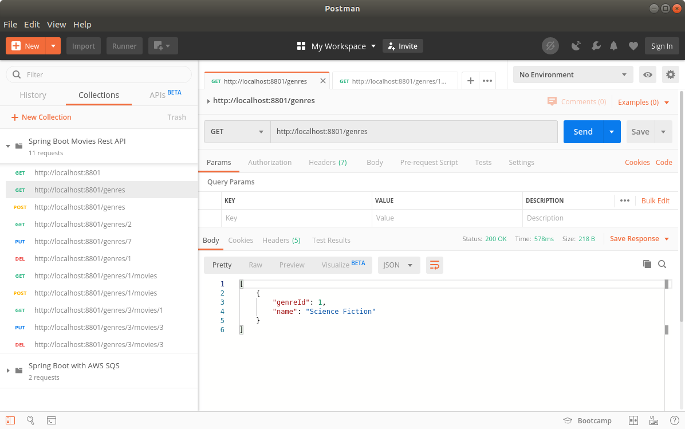
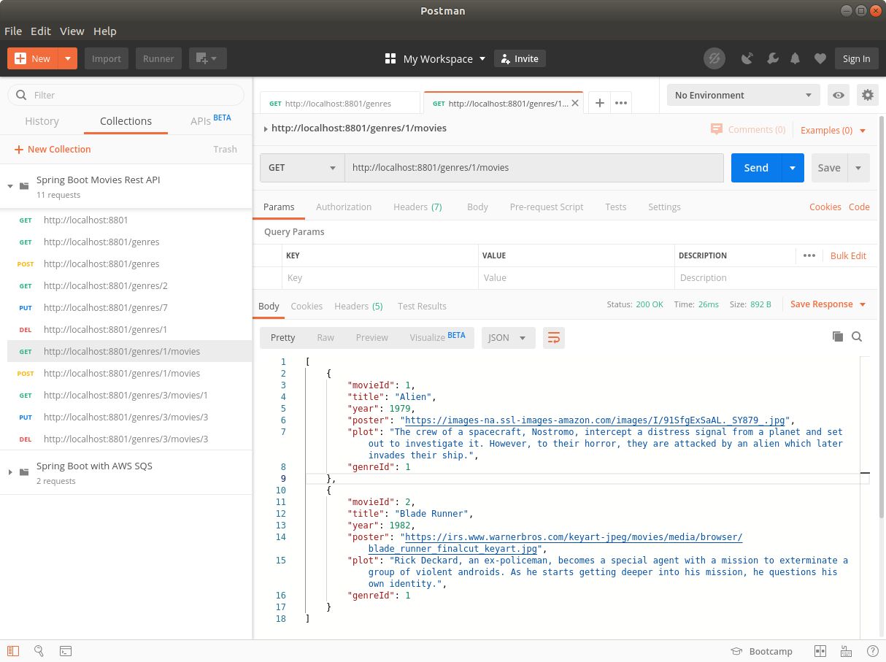

MOVIES REST API 
--------------------------------------------------------------------------

API Rest desarrollada con Spring Boot, MyBatis y MySQL.

Se exponen endpoints que permiten manipular información de películas
y géneros de cine.

--------------------------------------------------------------------------

Mediante MyBatis se mapean interfaces Mapper a procedimientos almacenados
en MySQL. 

Por ejemplo, en el caso de los géneros de cine, se mapea la interfaz
GenreMapper a los siguientes procedimientos almacenados:

```

<!DOCTYPE mapper
        PUBLIC "-//mybatis.org//DTD Mapper 3.0//EN"
        "http://mybatis.org/dtd/mybatis-3-mapper.dtd">

<mapper namespace="com.example.movies.mapper.GenreMapper">

    <resultMap type="com.example.movies.model.Genre" id="GenreResult">
        <id property="genreId" column="genre_id"/>
        <result property="name" column="name"/>
    </resultMap>

    <select id="getGenres" resultMap="GenreResult">
        {call retrieve_all_genres()}
    </select>

    <select id="getGenreById" resultType="com.example.movies.model.Genre">
        {call retrieve_genre_by_id(#{genreId})}
    </select>

    <insert id="addGenre" parameterType="com.example.movies.model.Genre" statementType="CALLABLE">
        {call insert_genre(#{genreId, mode=OUT, jdbcType=INTEGER}, #{name, mode=IN, jdbcType=VARCHAR})}
    </insert>

    <update id="updateGenre" parameterType="com.example.movies.model.Genre" >
        {call update_genre_by_id(#{genreId}, #{name})}
    </update>

    <delete id="deleteGenre" parameterType="int" >
        {call delete_genre_by_id(#{genreId})}
    </delete>

</mapper>


```

--------------------------------------------------------------------------

Se recuperan géneros de cine desde Postman:



--------------------------------------------------------------------------

Se recuperan películas por género desde Postman:



--------------------------------------------------------------------------